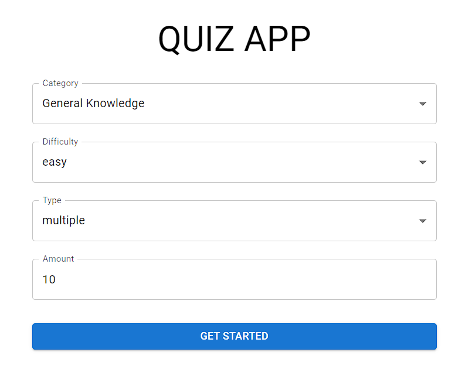

# Quiz App

A dynamic React quiz app with customizable settings, API-fetched questions, and score tracking using Redux Toolkit.

You can view the project live here:
[Quiz App](https://quizappreactredux.netlify.app/)

### Table of Contents

- [Project-features](#project-requirements-from-the-business)
- [Technologies](#getting-started)

## Project features

- Select Quiz Settings: Customize your quiz experience by selecting the number of questions, difficulty level, and category.
- Fetch Quiz Questions: Retrieve fresh quiz questions from an API for a new challenge each time you play.
- Answer Questions: Engage with quiz questions and select your answers easily.
- Score Tracking: Automatically update your total score with each correct answer.
- View Final Score: At the end of each quiz, see your total score and review the questions you answered incorrectly.
- User-Friendly Interface: Enjoy a clean, intuitive interface designed for an effortless quiz-taking experience.
- Responsive Design: Accessible on various devices, ensuring a smooth experience on mobile, tablet, and desktop.
- Material UI Styling: Enjoy a visually appealing and consistent design throughout the app with Material UI.

## Technologies

- 👉 Routing - React Router
- 👉 Styling - Material UI
- 👉 Remote state management - React Query
- 👉 Ui state management - Redux, Redux Toolkit
